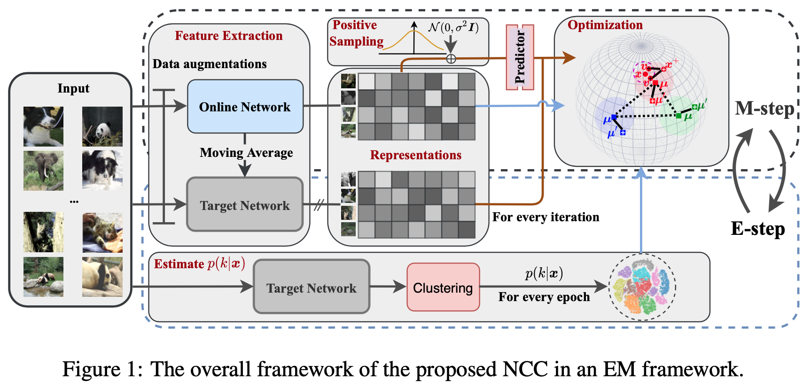
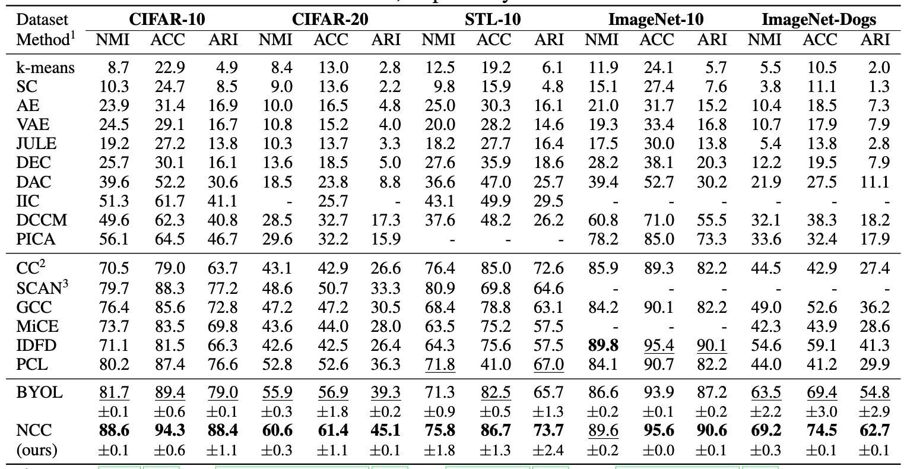

## Self-Supervised Learning for Deep Image Clustering

This repo provides some baseline self-supervised learning frameworks for deep image clustering based on PyTorch
including the official implementation of our [ProPos](https://arxiv.org/abs/2111.11821) accepted by **IEEE Transactions on Pattern Analysis and Machine Intelligence 2022**.

We have built new state-of-the-art performance on several benchmarked datasets.

> Learning Representation for Clustering via Prototype Scattering and Positive Sampling <br>
> https://arxiv.org/abs/2111.11821 <br>
> https://ieeexplore.ieee.org/document/9926200 <br>
> [Chinese Introduction](https://mp.weixin.qq.com/s/iV34ceH_Ob8VUMzD024vdA) <br>
> Abstract: Existing deep clustering methods rely on either contrastive or non-contrastive representation learning for downstream clustering task. Contrastive-based methods thanks to negative pairs learn uniform representations for clustering, in which negative pairs, however, may inevitably lead to the class collision issue and consequently compromise the clustering performance. Non-contrastive-based methods, on the other hand, avoid class collision issue, but the resulting non-uniform representations may cause the collapse of clustering. To enjoy the strengths of both worlds, this paper presents a novel end-to-end deep clustering method with prototype scattering and positive sampling, termed ProPos. Specifically, we first maximize the distance between prototypical representations, named prototype scattering loss, which improves the uniformity of representations. Second, we align one augmented view of instance with the sampled neighbors of another view -- assumed to be truly positive pair in the embedding space -- to improve the within-cluster compactness, termed positive sampling alignment. The strengths of ProPos are avoidable class collision issue, uniform representations, well-separated clusters, and within-cluster compactness. By optimizing ProPos in an end-to-end expectation-maximization framework, extensive experimental results demonstrate that ProPos achieves competing performance on moderate-scale clustering benchmark datasets and establishes new state-of-the-art performance on large-scale datasets.

**If you found this code helps your work, do not hesitate to cite my paper or star this repo!**

### Introduction

This repo contains the following baseline SSL methods for clustering:

1. ProPos (Ours) [[url](https://arxiv.org/abs/2111.11821)]
2. CC [[url](https://arxiv.org/abs/2009.09687)]
3. MoCo [[url](https://arxiv.org/abs/1911.05722)]
4. PCL [[url](https://arxiv.org/abs/2005.04966)]
5. SimCLR [[url](http://proceedings.mlr.press/v119/chen20j.html)]
6. SimSiam [[url](https://arxiv.org/abs/2011.10566)]
7. BYOL [[url](https://arxiv.org/abs/2006.07733)]
8. Linear Evaluation

The detail implementations and the results can be found in `models/`, and in the following table 2, respectively.

##### EM Framework



##### Main Results



### Training

#### Install requirements

I have rewritten the kmeans and GMM clustering using pure PyTorch, and the code can be found
at https://github.com/Hzzone/torch_clustering.

We need first clone it:

```shell
git clone --depth 1 https://github.com/Hzzone/torch_clustering tmp && mv tmp/torch_clustering . && rm -rf tmp
```

and then install other requirements:

```shell
pip install -r requirements.txt
```

#### Download the datasets

The datasets used in ProPos can be downloaded from official websites.

I have provided the image files of ImageNet-10 and ImageNet-Dogs as:
* [Google Drive](https://drive.google.com/drive/folders/1RGB0YxLpFlq8KXdrmHtAjdoYgxKq5-i5?usp=sharing)
* [Baidu Disk](https://pan.baidu.com/s/1cmRbjFAb3ypqrZUpC3fROQ?pwd=cy84) code cy84

#### Training Commands
The config files are in `config/`, just run the following command:
```shell
export CUDA_VISIBLE_DEVICES=0,1,2,3 # use the first 4 GPUs
torchrun --master_port 17673 --nproc_per_node=4 main.py config/cifar10_r18_propos.yml
```
or
```shell
export CUDA_VISIBLE_DEVICES=0,1,2,3 # use the first 4 GPUs
python -m torch.distributed.launch --nproc_per_node=4 --master_port=17672 main.py config/cifar10_r18_propos.yml
```

We can also enable the WANDB to visualize the training!

Set the `wandb` parameters to true, and login to wandb.ai:
```shell
wandb login xxx
```

#### Download the pretrained models and training logs

I have provided some pretrained models and their training logs:
* [Google Drive](https://drive.google.com/drive/folders/1cz2zeOIiIRUfbR6igAqLnp7FlR3hJ44E?usp=sharing)
* [Baidu Disk](https://pan.baidu.com/s/1aXZ-slODwBrXvPaxFzHKVQ?pwd=3bag) code 3bag

#### Visualize the learned representations

see `notebook/feature_visualization.ipynb` [](https://colab.research.google.com/github/Hzzone/ProPos/blob/master/notebook/feature_visualization.ipynb)

### Citation

If you found this code or our work useful please cite us:

```bibtex
@article{huang2022learning,
  title={Learning Representation for Clustering via Prototype Scattering and Positive Sampling},
  author={Zhizhong Huang and Jie Chen and Junping Zhang and Hongming Shan},
  journal={IEEE Transactions on Pattern Analysis and Machine Intelligence},
  year={2022},
}
```
