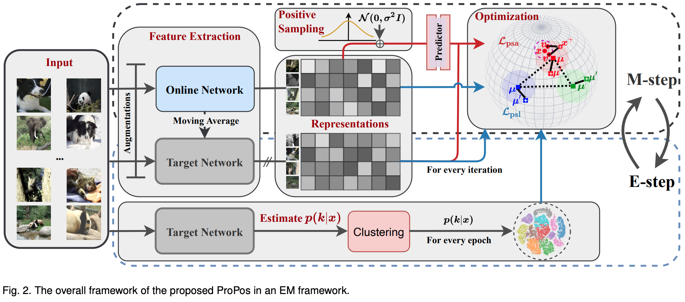
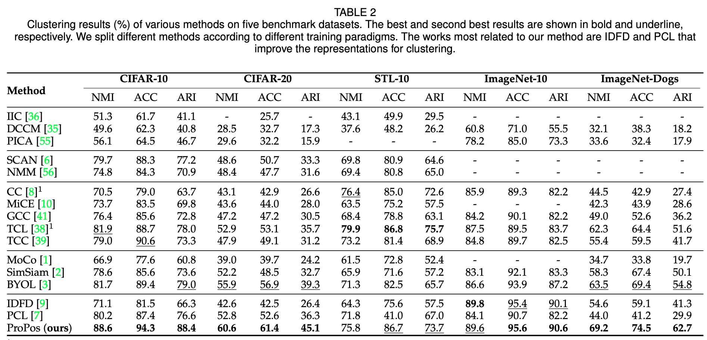

## Self-Supervised Learning for Deep Image Clustering

This repo aims to provide some baseline self-supervised learning frameworks for deep image clustering based on PyTorch including the official implementation of our [NCC](https://arxiv.org/abs/2111.11821).

We have built new state-of-the-art performance on several benchmarked datasets: CIFAR-10 [paperswithcode](https://paperswithcode.com/sota/image-clustering-on-cifar-10); CIFAR-20 [paperswithcode](https://paperswithcode.com/sota/image-clustering-on-cifar-100); ImageNet-10 [paperswithcode](https://paperswithcode.com/sota/image-clustering-on-imagenet-10) and ImageNet-Dogs [paperswithcode](https://paperswithcode.com/sota/image-clustering-on-imagenet-dog-15).

We are going to release the source code upon acceptance. Please refer to the pseudo-code in the Appendix.

>  Exploring Non-Contrastive Representation Learning for Deep Clustering
https://arxiv.org/abs/2111.11821
Abstract: Existing deep clustering methods rely on contrastive learning for representation learning, which requires negative examples to form an embedding space where all instances are well-separated. However, the negative examples inevitably give rise to the class collision issue, compromising the representation learning for clustering. In this paper, we explore non-contrastive representation learning for deep clustering, termed NCC, which is based on BYOL, a representative method without negative examples. First, we propose to align one augmented view of instance with the neighbors of another view in the embedding space, called positive sampling strategy, which avoids the class collision issue caused by the negative examples and hence improves the within-cluster compactness. Second, we propose to encourage alignment between two augmented views of one prototype and uniformity among all prototypes, named prototypical contrastive loss or ProtoCL, which can maximize the inter-cluster distance. Moreover, we formulate NCC in an Expectation-Maximization (EM) framework, in which E-step utilizes spherical k-means to estimate the pseudo-labels of instances and distribution of prototypes from a target network and M-step leverages the proposed losses to optimize an online network. As a result, NCC forms an embedding space where all clusters are well-separated and within-cluster examples are compact. Experimental results on several clustering benchmark datasets including ImageNet-1K demonstrate that NCC outperforms the state-of-the-art methods by a significant margin.

### Pseudo-code


### EM Framework



### Loss Function


### Main Results



### Citation

If you found this code or our work useful please cite us:

```bibtex
@misc{huang2021exploring,
    title={Exploring Non-Contrastive Representation Learning for Deep Clustering},
    author={Zhizhong Huang and Jie Chen and Junping Zhang and Hongming Shan},
    year={2021},
    eprint={2111.11821},
    archivePrefix={arXiv},
    primaryClass={cs.CV}
}
```

